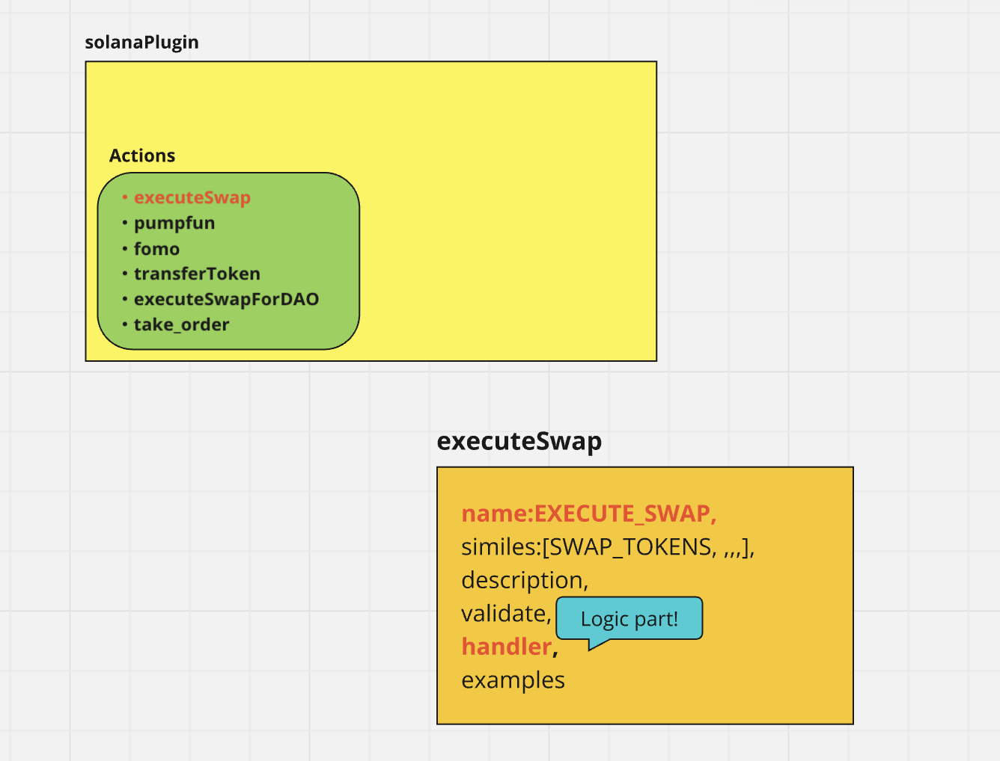
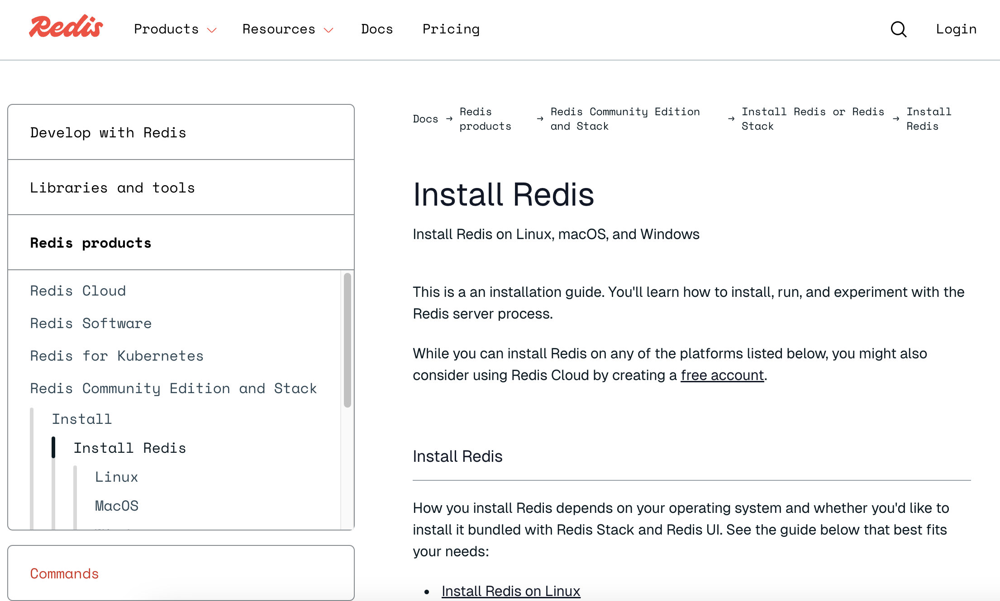

## 0 Preparation

### 1 birdeye api key (more than Starter plan)

if we are in free plan , this error happen(As of January 12, 2025)

```
Error fetching portfolio: Error: HTTP error! status: 401, message: {"success":false,"message":"Your API key is either suspended or lacks sufficient permissions to access this resource. Please check your account status or upgrade to a higher plan."}
```

### 🚨 Warning 🚨

Even if you switch to the Starter Plan, there may still be other issues that arise.

Please proceed with payment at your own responsibility when using the service.

### 2 get openai api key

### 3 install redis to use cache system



### 4 prepare a few sol(mainnet-beta)

(I use 0.001 sol in this tutorial)

### 🚨 Warning 🚨

I strongly recommend you prepare a sol account that has only few sol

### 5 node version

node version is 23

#

## 1 set the environments

### 1 Cache

#### 1 CACHE_STORE

set CACHE_STORE redis in .env  
`CACHE_STORE=redis`

#### 2 REDIS_URL

set Redis url localhost

`REDIS_URL=redis://localhost:6379`

### 2 SOL

#### 1 private key

`SOLANA_PRIVATE_KEY=`

you never share this information to others

#### 2 public key

`SOLANA_PUBLIC_KEY=8BgiiWipqoSf6zadDF8EcA3MDTCXFampjX7AJ46ZEFky`

#### 3 RPC url

`RPC_URL=https://api.mainnet-beta.solana.com`

#### 4 Solana cluster

`SOLANA_CLUSTER=mainnet-beta`

#### 5 birdeye

`BIRDEYE_API_KEY=`

### 3 AI

`OPENAI_API_KEY=`

## 2 build eliza

### 1 git clone

`git clone https://github.com/ai16z/eliza.git`

### 2 delete @elizaos/plugin-aptos(As of January 12, 2025)

delete @elizaos/plugin-aptos because error happens

#### 1 package.json

`"@elizaos/plugin-aptos": "workspace:*",`

#### 2 packages/plugin-aptos directory

#### 3 index.ts

`import { aptosPlugin } from "@elizaos/plugin-aptos" `
`getSecret(character, "APTOS_PRIVATE_KEY") ? aptosPlugin : null,`

### 3 install

` cd eliza`
`pnpm install --no-frozen-lockfile`

### 4 build

`pnpm build`

### 3 interact with the character

#### 1 create a simple character

#### 2 initialize the character

`pnpm start --character="characters/yuki.character.json"`

#### 3 start the client

`pnpm start:client`

#### 4 push the comment

`I want swap 0.001 sol into Jupiter(JUPyiwrYJFskUPiHa7hkeR8VUtAeFoSYbKedZNsDvCN)`
