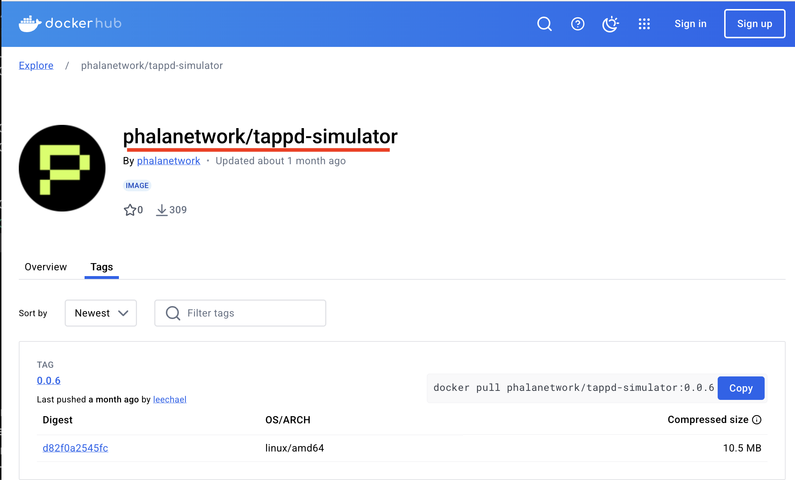
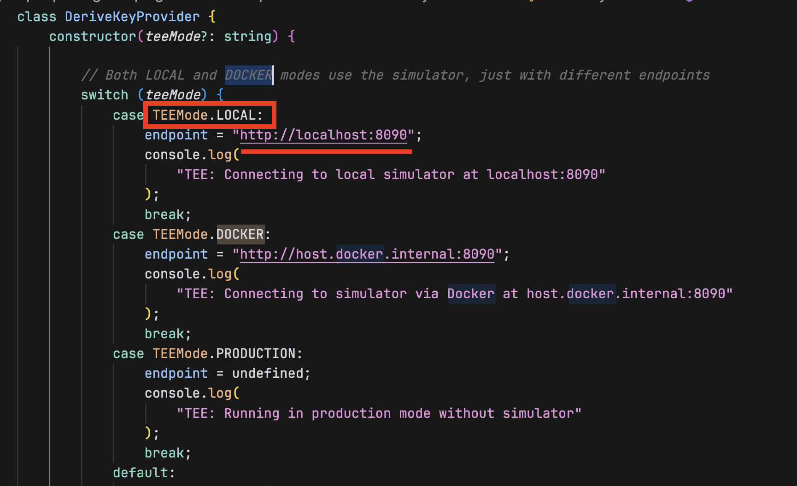

# 0 Preparation

### 1 get openAI api key

### 2 node version is 23

### 3 install Docker Desktop or Orbstack (Orbstack is recommended)

`docker --version`

# 1 run the docker

### 1 pull the image

`docker pull phalanetwork/tappd-simulator:latest`

### 2 run the image

`docker run --rm -p 8090:8090 phalanetwork/tappd-simulator:latest`

# 2 prepare for the character

### 1 git clone

`git clone https://github.com/ai16z/eliza.git`

in this lesson, I use this repository

`https://github.com/ytakahashi2020/eliza_temp`

### 2 install

`pnpm install --no-frozen-lockfile`

### 3 set .env information

`OPENAI_API_KEY`  
`TEE_MODE=LOCAL`  
`WALLET_SECRET_SALT=<Any name>`

### 4 create a simple character

# 3 start the agent

### 1 build

`pnpm build`

### 2 Start the agent

`pnpm start --character="characters/yuki.character.json"`

### 3 start client

`pnpm start:client`
